<!--
  
-->
  <!--
    
-->
  
  
  
  
  
  
  

   

  
  
  
  
  
  
  
  

 

# 👨‍💻 About me

- 🔭 &nbsp;Building **web apps with Next.js** and **automating workflows**
- 🌱 &nbsp;Exploring **self-hosting** & **home-lab automation** with `n8n` and `Docker`
- 🤖 &nbsp;I like automating boring, repetitive things away
- 💬 &nbsp;Ask me about **Next.js**, **TypeScript**, or **workflow automation**
- 📍 &nbsp;Based in Seoul, Republic of Korea
- ⚡ &nbsp;Fun fact: I'll happily spend 3 hours automating a 5-minute task

 

# 📊 GitHub Stats

  
  

    

  

    

  <!-- github-profile-summary-cards -->
  

    

  
  

    

  
  

 

# 📈 Metrics

  <!-- lowlighter/metrics — generated by .github/workflows/metrics.yml -->
  

